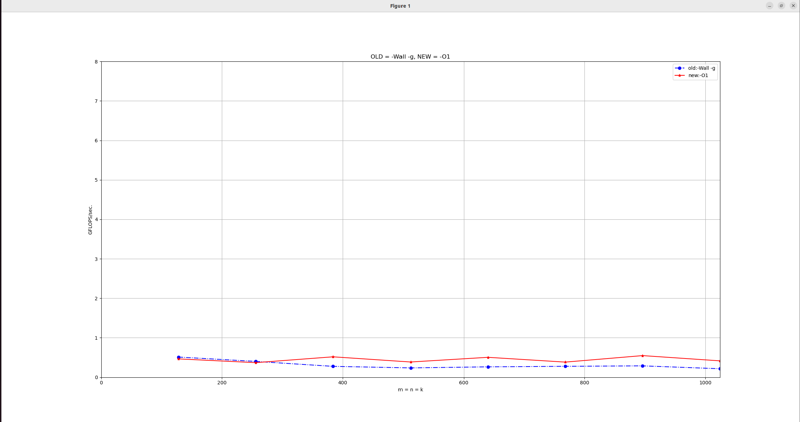
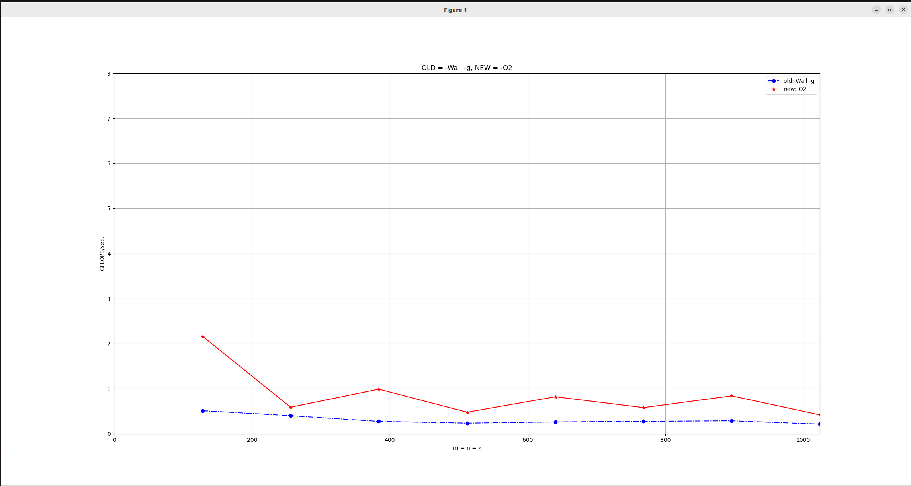
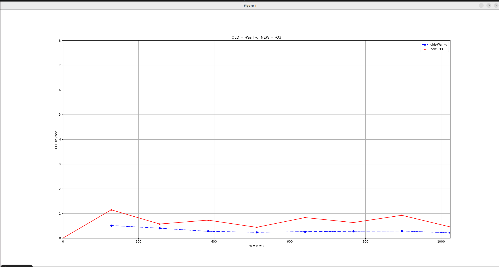
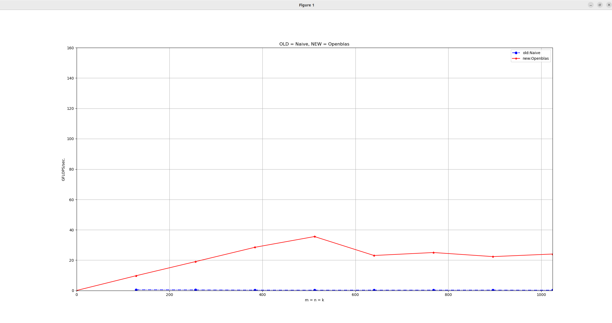

# 高性能计算实践-实验三

220110519 邢瑞龙 2023秋季

**实验环境**：

1. OS：Linux Ubuntu 22.04
2. gcc: version 11.40(Ubuntu 11.40-1Ubuntu ~22.04)
3. CPU:11th Gen Intel(R) Core(TM) i7-1165G7 @2.80GHz cpu cores:1 (虚拟机)
4. 内存 3911MB

## gcc不同编译选项对比

1. **O1**:  对程序做部分编译优化，对于大函数,优化编译占用稍微多的时间和相当大的内存。使用本项优化，编译器会尝试减小生成代码的尺寸，以及缩短执行时间，但并不执行需要占用大量编译时间的优化。 

2. **O2**:  与O1比较而言，O2优化增加了编译时间的基础上，提高了生成代码的执行效率。 

2. **O3**： 在O2的基础上进行更多的优化

# Naive 和Openblas对比

* 由图可见Openblas程序下运行速度提高了百倍左右