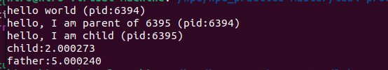
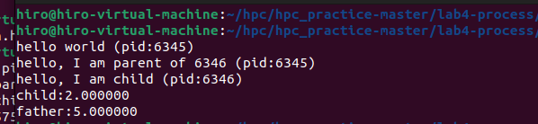

# 高性能计算实践-实验4

220110519 邢瑞龙 2023秋季

## 实验环境

1. OS：Linux Ubuntu 22.04
2. gcc: version 11.40(Ubuntu 11.40-1Ubuntu ~22.04)
3. CPU:11th Gen Intel(R) Core(TM) i7-1165G7 @2.80GHz cpu cores:1 (虚拟机)
4. 内存 3911MB

## 改造1-sleep()函数

```c++
#include <stdio.h>
#include <stdlib.h>
#include <unistd.h>
#include<time.h>
#include"common.h"
int main(int argc, char *argv[])
{
    printf("hello world (pid:%d)\n", (int) getpid());
    int rc = fork();
    struct timeval start,finish;
    if (rc < 0) {
        // fork failed; exit
        fprintf(stderr, "fork failed\n");
        exit(1);
    } else if (rc == 0) {
        // child (new process)
        printf("hello, I am child (pid:%d)\n", (int) getpid());
        gettimeofday(&start, NULL);
        sleep(2);
        //Spin(2);
        gettimeofday(&finish, NULL);
        double duration = ((double)(finish.tv_sec-start.tv_sec)*1000000 + (double)(finish.tv_usec-		start.tv_usec)) / 1000000;
        printf("child:%lf\n",duration);
    } else {
        // parent goes down this path (original process)
        printf("hello, I am parent of %d (pid:%d)\n",
	       rc, (int) getpid());
	     gettimeofday(&start, NULL);      
	     sleep(5);
	     //Spin(5);
	     gettimeofday(&finish, NULL);
	     double duration = ((double)(finish.tv_sec-start.tv_sec)*1000000 + (double)(finish.tv_usec-		start.tv_usec)) / 1000000;
         printf("father:%lf\n",duration);
    }

    return 0;
}
```

**结果**：



## 改造二-Spin()函数

```c++
#include <stdio.h>
#include <stdlib.h>
#include <unistd.h>
#include<time.h>
#include"common.h"
int main(int argc, char *argv[])
{
    printf("hello world (pid:%d)\n", (int) getpid());
    int rc = fork();
    struct timeval start,finish;
    if (rc < 0) {
        // fork failed; exit
        fprintf(stderr, "fork failed\n");
        exit(1);
    } else if (rc == 0) {
        // child (new process)
        printf("hello, I am child (pid:%d)\n", (int) getpid());
        gettimeofday(&start, NULL);
        //sleep(2);
        Spin(2);
        gettimeofday(&finish, NULL);
        double duration = ((double)(finish.tv_sec-start.tv_sec)*1000000 + (double)(finish.tv_usec-		start.tv_usec)) / 1000000;
        printf("child:%lf\n",duration);
    } else {
        // parent goes down this path (original process)
        printf("hello, I am parent of %d (pid:%d)\n",
	       rc, (int) getpid());
	     gettimeofday(&start, NULL);      
	     //sleep(5);
	     Spin(5);
	     gettimeofday(&finish, NULL);
	     double duration = ((double)(finish.tv_sec-start.tv_sec)*1000000 + (double)(finish.tv_usec-		start.tv_usec)) / 1000000;
         printf("father:%lf\n",duration);
    }

    return 0;
}
```

**结果**：



## 结论

对比可知

* Spin函数结果比sleep函数的更为精确

## 原因分析

* `Spin()` 函数通过循环在一段时间内不断检查当前时间，直到时间达到了指定的延迟，这段时间一直占用cpu资源，然后返回。结果更为精确但占用cpu资源
* `sleep()` 函数是一个系统调用，它会将当前线程（或进程）挂起，让出CPU的控制权，并在指定的时间内不执行任何操作，然后再次被唤醒继续执行。这种方式不会占用CPU时间片。结果相对不精确但对系统友好。