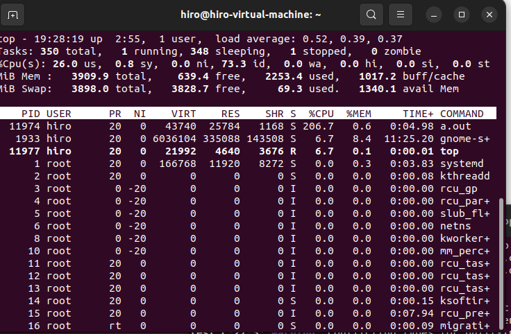

# 高性能计算实践-实验五

220110519 邢瑞龙 2023秋季

## 实验环境

1. OS：Linux Ubuntu 22.04
2. gcc: version 11.40(Ubuntu 11.40-1Ubuntu ~22.04)
3. CPU:11th Gen Intel(R) Core(TM) i7-1165G7 @2.80GHz cpu cores:2 (虚拟机)
4. 内存 3911MB

## 使用top查看cpu情况



## 实验方案

* 采用固定分块16x16的方式

## 双线程与naive对比

双线程代码：

```c++
#include <stdio.h>
#include <stdlib.h>
#include <time.h>
#include "common.h"
#include <assert.h>
#include <pthread.h>
#include <unistd.h>
#include <sys/time.h>

#define N 1024
#define M 16
#define NUM_THREADS 2

double A[N][N];
double B[N][N];
double C[N][N];

typedef struct {
    int n;
    double* a;
    double* b;
    double* c;
    int start_row;
    int end_row;
} myarg_t;

int fmin(int a, int b) {
    if (a < b) return a;
    else return b;
}

// Matrix multiplication function
void *dgemm(void *arg) {
    myarg_t *args = (myarg_t *)arg;
    int n = args->n;
    double *C = args->c;
    double *A = args->a;
    double *B = args->b;
    int start_row = args->start_row;
    int end_row = args->end_row;

    for (int ii = start_row; ii < end_row; ii += M) {
        for (int jj = 0; jj < n; jj += M) {
            for (int kk = 0; kk < n; kk += M) {
                for (int i = ii; i < fmin(ii + M, end_row); i++) {
                    for (int j = jj; j < fmin(jj + M, n); j++) {
                        for (int k = kk; k < fmin(kk + M, n); k++) {
                            C[i * n + j] += A[i * n + k] * B[k * n + j];
                        }
                    }
                }
            }
        }
    }
    return NULL;
}

int main() {
    // Initialize matrices A and B (for simplicity, assuming random values)
    for (int i = 0; i < N; i++) {
        for (int j = 0; j < N; j++) {
            A[i][j] = (double)rand() / RAND_MAX;
            B[i][j] = (double)rand() / RAND_MAX;
            C[i][j] = 0.0;
        }
    }

    myarg_t args[NUM_THREADS];
    pthread_t threads[NUM_THREADS];
    struct timeval start, finish;
    
    
    gettimeofday(&start, NULL);
    int chunk_size = N / NUM_THREADS;
    for (int i = 0; i < NUM_THREADS; i++) {
        args[i].n = N;
        args[i].a = (double *)A;
        args[i].b = (double *)B;
        args[i].c = (double *)C;
        args[i].start_row = i * chunk_size;
        args[i].end_row = (i == NUM_THREADS - 1) ? N : (i + 1) * chunk_size;
        
        int rc = pthread_create(&threads[i], NULL, dgemm, &args[i]);
        assert(rc == 0);
    }
   
    for (int i = 0; i < NUM_THREADS; i++) {
        int rc = pthread_join(threads[i], NULL);
        assert(rc == 0);
    }
    
    gettimeofday(&finish, NULL);
    double duration = ((double)(finish.tv_sec - start.tv_sec) * 1000000 + (double)(finish.tv_usec - start.tv_usec)) / 1000000;
    printf("Total time: %lf seconds\n", duration);

    return 0;
}

```

单线程代码:

```c++
#include <stdio.h>
#include <stdlib.h>
#include <time.h>
#include "common.h"
#include <assert.h>
#include <pthread.h>
#include <unistd.h>
#include <sys/time.h>

#define N 1024
#define M 16

double A[N][N];
double B[N][N];
double C[N][N];

typedef struct {
    int n;
    double* a;
    double* b;
    double* c;
    int start_row;
    int end_row;
} myarg_t;

int fmin(int a, int b) {
    if (a < b) return a;
    else return b;
}

// Matrix multiplication function
void *dgemm(void *arg) {
    myarg_t *args = (myarg_t *)arg;
    int n = args->n;
    double *C = args->c;
    double *A = args->a;
    double *B = args->b;
    int start_row = args->start_row;
    int end_row = args->end_row;

    for (int ii = start_row; ii < end_row; ii += M) {
        for (int jj = 0; jj < n; jj += M) {
            for (int kk = 0; kk < n; kk += M) {
                for (int i = ii; i < fmin(ii + M, end_row); i++) {
                    for (int j = jj; j < fmin(jj + M, n); j++) {
                        for (int k = kk; k < fmin(kk + M, n); k++) {
                            C[i * n + j] += A[i * n + k] * B[k * n + j];
                        }
                    }
                }
            }
        }
    }
    return NULL;
}

int main() {
    // Initialize matrices A and B (for simplicity, assuming random values)
    for (int i = 0; i < N; i++) {
        for (int j = 0; j < N; j++) {
            A[i][j] = (double)rand() / RAND_MAX;
            B[i][j] = (double)rand() / RAND_MAX;
            C[i][j] = 0.0;
        }
    }

    myarg_t args;
    struct timeval start, finish;
    
    
    gettimeofday(&start, NULL);
 
  	pthread_t p1;
  	args.n = N;
        args.a = (double *)A;
        args.b = (double *)B;
        args.c = (double *)C;
        args.start_row = 0;
        args.end_row = N;
   	int rc = pthread_create(&p1, NULL, dgemm, &args);
    	assert(rc == 0);
    
   
   	rc=pthread_join(p1, NULL);
   	assert(rc==0);
    
    gettimeofday(&finish, NULL);
    double duration = ((double)(finish.tv_sec - start.tv_sec) * 1000000 + (double)(finish.tv_usec - start.tv_usec)) / 1000000;
    printf("Total time: %lf seconds\n", duration);

    return 0;
}
```

naive代码：

````c++
#include <stdio.h>
#include <stdlib.h>
#include <time.h>
#include "common.h"
#include <assert.h>
#include <pthread.h>
#include <unistd.h>
#include <sys/time.h>

#define N 1024
#define M 16

double A[N][N];
double B[N][N];
double C[N][N];

typedef struct {
    int n;
    double* a;
    double* b;
    double* c;
    int start_row;
    int end_row;
} myarg_t;

int fmin(int a, int b) {
    if (a < b) return a;
    else return b;
}

// Matrix multiplication function
void *dgemm(void *arg) {
    myarg_t *args = (myarg_t *)arg;
    int n = args->n;
    double *C = args->c;
    double *A = args->a;
    double *B = args->b;
    int start_row = args->start_row;
    int end_row = args->end_row;

    for(int i=0;i<n;i++)
    	for(int j=0;j<n;j++)
    		for(int k=0;k<n;k++)
    		{
    			C[i*n+j]+=A[i*n+k]*B[k*n+j];
    		}
    return NULL;
}

int main() {
    // Initialize matrices A and B (for simplicity, assuming random values)
    for (int i = 0; i < N; i++) {
        for (int j = 0; j < N; j++) {
            A[i][j] = (double)rand() / RAND_MAX;
            B[i][j] = (double)rand() / RAND_MAX;
            C[i][j] = 0.0;
        }
    }

    myarg_t args;
    struct timeval start, finish;
    
    
    gettimeofday(&start, NULL);
 
  	pthread_t p1;
  	args.n = N;
        args.a = (double *)A;
        args.b = (double *)B;
        args.c = (double *)C;
        args.start_row = 0;
        args.end_row = N;
   	int rc = pthread_create(&p1, NULL, dgemm, &args);
    	assert(rc == 0);
    
   
   	rc=pthread_join(p1, NULL);
   	assert(rc==0);
    
    gettimeofday(&finish, NULL);
    double duration = ((double)(finish.tv_sec - start.tv_sec) * 1000000 + (double)(finish.tv_usec - start.tv_usec)) / 1000000;
    printf("Total time: %lf seconds\n", duration);

    return 0;
}
````


双线程运行时间：


单线程运行时间：


不分块naive版本运行时间：


* 总结：运行速度:双线程分块>单线程分块>单线程不分块

## 遇到的问题

* 中间动态分配又遇到栈溢出的问题，采用全局变量解决
* 对分块矩阵运算过程不清楚，上网学习才了解

