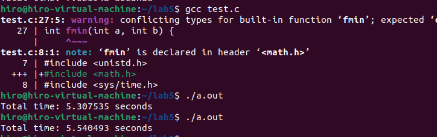
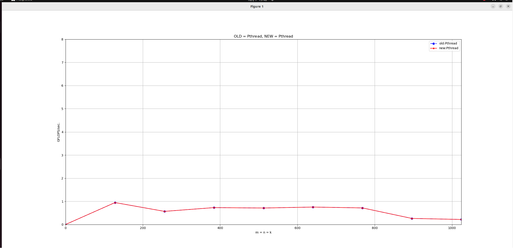

# 高性能计算实践-实验六

220110519 邢瑞龙 2023秋季

## 实验环境

1. OS：Linux Ubuntu 22.04
2. gcc: version 11.40(Ubuntu 11.40-1Ubuntu ~22.04)
3. CPU:11th Gen Intel(R) Core(TM) i7-1165G7 @2.80GHz cpu cores:2 (虚拟机)
4. 内存 3911MB

## naive
朴素矩阵乘法
```c++
#include "stdio.h"
#include "stdlib.h"
#include "sys/time.h"
#include "time.h"
#include "f77blas.h"
// void dgemm_(char*, char*, int*, int*,int*, double*, double*, int*, double*, int*, double*, double*, int*);

int main(int argc, char* argv[])
{
  int i;
  printf("test!\n");
  if(argc<4){
    printf("Input Error\n");
    return 1;
  }

  int m = atoi(argv[1]);
  int n = atoi(argv[2]);
  int k = atoi(argv[3]);
  int sizeofa = m * k;
  int sizeofb = k * n;
  int sizeofc = m * n;
  char ta = 'N';
  char tb = 'N';
  double alpha = 1.2;
  double beta = 0.001;

  struct timeval start,finish;
  double duration;

  double* A = (double*)malloc(sizeof(double) * sizeofa);
  double* B = (double*)malloc(sizeof(double) * sizeofb);
  double* C = (double*)malloc(sizeof(double) * sizeofc);

  srand((unsigned)time(NULL));

  for (i=0; i<sizeofa; i++)
    A[i] = i%3+1;//(rand()%100)/10.0;

  for (i=0; i<sizeofb; i++)
    B[i] = i%3+1;//(rand()%100)/10.0;

  for (i=0; i<sizeofc; i++)
    C[i] = i%3+1;//(rand()%100)/10.0;
  //#if 0
  printf("m=%d,n=%d,k=%d,alpha=%lf,beta=%lf,sizeofc=%d\n",m,n,k,alpha,beta,sizeofc);
  gettimeofday(&start, NULL);
  dgemm_(&ta, &tb, &m, &n, &k, &alpha, A, &m, B, &k, &beta, C, &m);
  gettimeofday(&finish, NULL);

  duration = ((double)(finish.tv_sec-start.tv_sec)*1000000 + (double)(finish.tv_usec-start.tv_usec)) / 1000000;
  double gflops = 2.0 * m *n*k;
  gflops = gflops/duration*1.0e-6/1000;

  FILE *fp;
  fp = fopen("timeDGEMM.txt", "a");
  fprintf(fp, "%dx%dx%d\t%lf s\t%lf GFLOPS\n", m, n, k, duration, gflops);
  fclose(fp);

  free(A);
  free(B);
  free(C);
  return 0;
}

```
## Openblas
```c++
#include "stdio.h"
#include "stdlib.h"
#include "sys/time.h"
#include "time.h"
#include "f77blas.h"
// void dgemm_(char*, char*, int*, int*,int*, double*, double*, int*, double*, int*, double*, double*, int*);

int main(int argc, char* argv[])
{
  int i;
  printf("test!\n");
  if(argc<4){
    printf("Input Error\n");
    return 1;
  }

  int m = atoi(argv[1]);
  int n = atoi(argv[2]);
  int k = atoi(argv[3]);
  int sizeofa = m * k;
  int sizeofb = k * n;
  int sizeofc = m * n;
  char ta = 'N';
  char tb = 'N';
  double alpha = 1.2;
  double beta = 0.001;

  struct timeval start,finish;
  double duration;

  double* A = (double*)malloc(sizeof(double) * sizeofa);
  double* B = (double*)malloc(sizeof(double) * sizeofb);
  double* C = (double*)malloc(sizeof(double) * sizeofc);

  srand((unsigned)time(NULL));

  for (i=0; i<sizeofa; i++)
    A[i] = i%3+1;//(rand()%100)/10.0;

  for (i=0; i<sizeofb; i++)
    B[i] = i%3+1;//(rand()%100)/10.0;

  for (i=0; i<sizeofc; i++)
    C[i] = i%3+1;//(rand()%100)/10.0;
  //#if 0
  printf("m=%d,n=%d,k=%d,alpha=%lf,beta=%lf,sizeofc=%d\n",m,n,k,alpha,beta,sizeofc);
  gettimeofday(&start, NULL);
  dgemm_(&ta, &tb, &m, &n, &k, &alpha, A, &m, B, &k, &beta, C, &m);
  gettimeofday(&finish, NULL);

  duration = ((double)(finish.tv_sec-start.tv_sec)*1000000 + (double)(finish.tv_usec-start.tv_usec)) / 1000000;
  double gflops = 2.0 * m *n*k;
  gflops = gflops/duration*1.0e-6/1000;

  FILE *fp;
  fp = fopen("timeDGEMM.txt", "a");
  fprintf(fp, "%dx%dx%d\t%lf s\t%lf GFLOPS\n", m, n, k, duration, gflops);
  fclose(fp);

  free(A);
  free(B);
  free(C);
  return 0;
}

```
## naive和Openblas对比

## 多线程
代码
```c++
#include <stdio.h>
#include <stdlib.h>
#include <time.h>
#include "common.h"
#include <assert.h>
#include <pthread.h>
#include <unistd.h>
#include <sys/time.h>

#define N 1024
#define M 16
#define NUM_THREADS 2

double A[N][N];
double B[N][N];
double C[N][N];

typedef struct {
    int n;
    double* a;
    double* b;
    double* c;
    int start_row;
    int end_row;
} myarg_t;

int fmin(int a, int b) {
    if (a < b) return a;
    else return b;
}

// Matrix multiplication function
void *dgemm(void *arg) {
    myarg_t *args = (myarg_t *)arg;
    int n = args->n;
    double *C = args->c;
    double *A = args->a;
    double *B = args->b;
    int start_row = args->start_row;
    int end_row = args->end_row;

    for (int ii = start_row; ii < end_row; ii += M) {
        for (int jj = 0; jj < n; jj += M) {
            for (int kk = 0; kk < n; kk += M) {
                for (int i = ii; i < fmin(ii + M, end_row); i++) {
                    for (int j = jj; j < fmin(jj + M, n); j++) {
                        for (int k = kk; k < fmin(kk + M, n); k++) {
                            C[i * n + j] += A[i * n + k] * B[k * n + j];
                        }
                    }
                }
            }
        }
    }
    return NULL;
}

int main() {
    // Initialize matrices A and B (for simplicity, assuming random values)
    for (int i = 0; i < N; i++) {
        for (int j = 0; j < N; j++) {
            A[i][j] = (double)rand() / RAND_MAX;
            B[i][j] = (double)rand() / RAND_MAX;
            C[i][j] = 0.0;
        }
    }

    myarg_t args[NUM_THREADS];
    pthread_t threads[NUM_THREADS];
    struct timeval start, finish;
    
    
    gettimeofday(&start, NULL);
    int chunk_size = N / NUM_THREADS;
    for (int i = 0; i < NUM_THREADS; i++) {
        args[i].n = N;
        args[i].a = (double *)A;
        args[i].b = (double *)B;
        args[i].c = (double *)C;
        args[i].start_row = i * chunk_size;
        args[i].end_row = (i == NUM_THREADS - 1) ? N : (i + 1) * chunk_size;
        
        int rc = pthread_create(&threads[i], NULL, dgemm, &args[i]);
        assert(rc == 0);
    }
   
    for (int i = 0; i < NUM_THREADS; i++) {
        int rc = pthread_join(threads[i], NULL);
        assert(rc == 0);
    }
    
    gettimeofday(&finish, NULL);
    double duration = ((double)(finish.tv_sec - start.tv_sec) * 1000000 + (double)(finish.tv_usec - start.tv_usec)) / 1000000;
    printf("Total time: %lf seconds\n", duration);

    return 0;
}

```
运行时间：
1024规模下 5.53s


Gflops:


## Openmp
代码：
```c++
#include <stdio.h>
#include <stdlib.h>
#include <time.h>
#include "common.h"
#include <assert.h>
#include <sys/time.h>
#include <omp.h>

#define N 1024
#define M 16
#define NUM_THREADS 4

double A[N][N];
double B[N][N];
double C[N][N];

int fmin(int a, int b) {
    if (a < b) return a;
    else return b;
}

// Matrix multiplication function
void dgemm(int n, double *A, double *B, double *C) {
    #pragma omp parallel for num_threads(NUM_THREADS)
    for (int ii = 0; ii < n; ii += M) {
        for (int jj = 0; jj < n; jj += M) {
            for (int kk = 0; kk < n; kk += M) {
                for (int i = ii; i < fmin(ii + M, n); i++) {
                    for (int j = jj; j < fmin(jj + M, n); j++) {
                        for (int k = kk; k < fmin(kk + M, n); k++) {
                            C[i * n + j] += A[i * n + k] * B[k * n + j];
                        }
                    }
                }
            }
        }
    }
}

int main() {
    // Initialize matrices A and B (for simplicity, assuming random values)
    for (int i = 0; i < N; i++) {
        for (int j = 0; j < N; j++) {
            A[i][j] = (double)rand() / RAND_MAX;
            B[i][j] = (double)rand() / RAND_MAX;
            C[i][j] = 0.0;
        }
    }

    struct timeval start, finish;
    gettimeofday(&start, NULL);

    dgemm(N, (double *)A, (double *)B, (double *)C);

    gettimeofday(&finish, NULL);
    double duration = ((double)(finish.tv_sec - start.tv_sec) * 1000000 + (double)(finish.tv_usec - start.tv_usec)) / 1000000;
    printf("Total time: %lf seconds\n", duration);

    return 0;
}

```
运行时间：
1024规模下 2.8s

Gflops:


## 遇到的问题
* 多线程程序的书写规范：知乎博客习得
* 画gflops图：使用之前实验中的python程序完成