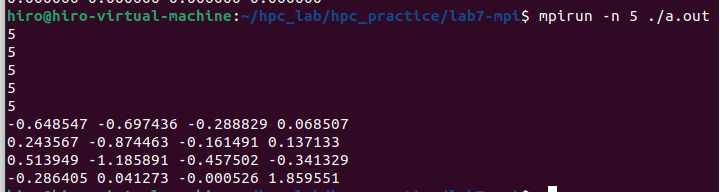
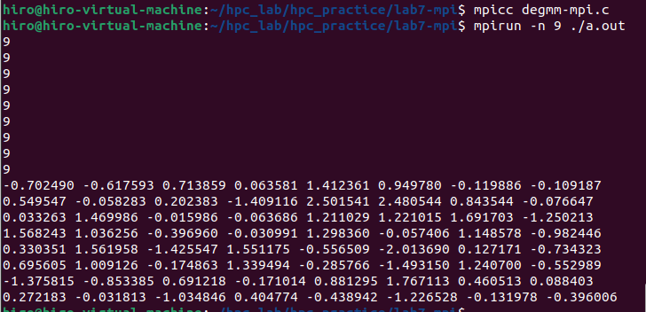

# 高性能计算实践-实验七
220110519 邢瑞龙 2023秋季

## 实验环境

1. OS：Linux Ubuntu 22.04
2. gcc: version 11.40(Ubuntu 11.40-1Ubuntu ~22.04)
3. CPU:11th Gen Intel(R) Core(TM) i7-1165G7 @2.80GHz cpu cores:2 (虚拟机)
4. 内存 3911MB

## MPI实现矩阵乘法加速
MPI程序流程：
``` c++
MPI_Init(&argc, &argv) //只要用到MPI最开始都需要调用此函数
int MPI_Comm_Rank(MPI_Comm comm, int *rank) //该函数是获得当前进程的进程标识，每个进程都有一个id
int MPI_Comm_Size(MPI_Comm, int *size) //获取总进程数并保存在size中

/*buf是被传输数据首位地址，而count是被传输数据大小，dest为目的进程的idcomm为通行组*/
int MPI_Send(type* buf, int count, MPI_Datatype, int dest, int tag, MPI_Comm comm) 
/*source 为数据来源的进程id*/
int MPI_Recv(type* buf, int count, MPI_Datatype, int source, int tag, MPI_Comm comm, MPI_Status *status) 
//MPI_Finalize函数清理与 MPI 相关的所有状态。
MPI_Finalize()
```
**基于mpi实现矩阵乘法加速的思想**：将A矩阵按行分块给不同进程来方便进程传输数据

代码：
```c++
#include <stdio.h>
#include <stdlib.h>
#include <mpi.h>

#define N 4
double a[N][N]={
-1.000000e+00, -2.707955e-01, 5.350056e-02, 8.634630e-01, 
-9.980292e-01, -8.173388e-01, -9.113315e-02, 1.361192e-01, 
-9.167380e-01, -8.154047e-01, -5.336431e-01, 1.121887e-01, 
-6.467147e-01, -2.556555e-02, 6.625836e-01, -8.983362e-01, 
};
double b[N][N]={
5.341023e-01, 7.519617e-01, 6.208589e-01, -8.464509e-01, 
-9.621704e-01, 6.311373e-02, -6.231595e-01, 6.305478e-01, 
-4.952805e-01, 8.405219e-01, 7.726289e-01, 9.697820e-01, 
-4.036057e-01, 3.086230e-02, 1.412280e-01, -7.632966e-01, 
};
void matMulti(double *A, double *B, double*C, int row, int n){
    for (int i = 0; i < row; i++){
        for (int j = 0; j < n; j++){
            C[i*n + j] = 0;
            for (int k = 0; k < n; k++) 
                C[i*n + j] += A[i*n + k] * B[k*n + j];
        }
    }
}
int main(int argc, char *argv[]) {
    int n=N;
    int rank, size;
    MPI_Status status;
    MPI_Init(&argc, &argv);
    MPI_Comm_rank(MPI_COMM_WORLD, &rank);
    MPI_Comm_size(MPI_COMM_WORLD, &size); 
    printf("%d\n",size);
    int each_row=n/(size-1);
    // 主进程初始化矩阵 A 和 B
    if (rank == 0) { 
        // 初始化矩阵 A 和 B
        // ...
        double *A = (double *)malloc(N * N* sizeof(double));
        double *B = (double *)malloc(N * N* sizeof(double));
        double *C = (double *)malloc(N * N* sizeof(double));

        for(int i=0;i<N;i++)
        {
            for(int j=0;j<N;j++)
            {
                A[i*N+j]=a[i][j];
                B[i*N+j]=b[i][j];
            }
        }
        for(int i=0;i<size-1;i++)
        {
            int begin_row=each_row*i;
            int end_row=each_row*(i+1);
            MPI_Send(&A[begin_row*N+0],each_row*N,MPI_DOUBLE,i+1,1,MPI_COMM_WORLD);
            MPI_Send(&B[0 * N+ 0], N * N, MPI_DOUBLE, i + 1, 2, MPI_COMM_WORLD);
        }
        for (int i = 0; i < size-1; i++){
         	int begin_row=each_row*i;
            MPI_Recv(&C[begin_row * n + 0], each_row*n, MPI_DOUBLE, i + 1, 3, MPI_COMM_WORLD, &status);
        }
        for(int i=0;i<n;i++)
        {
            for(int j=0;j<n;j++)
            {
                printf("%lf ",C[i*n+j]);
            }
            printf("\n");
        }
    }
    else  //子进程进行运算并send给主进程进行合并
    {
        double* A = (double *)malloc(each_row * N* sizeof(double)); // A[beginRow:endRow, :]
        double* B = (double *)malloc(N * N* sizeof(double));
        double* C= (double *)malloc(each_row * N* sizeof(double)); 
        MPI_Recv(&A[0 * n + 0], each_row * n, MPI_DOUBLE, 0, 1, MPI_COMM_WORLD, &status);
        MPI_Recv(&B[0 * n + 0], n * n, MPI_DOUBLE, 0, 2, MPI_COMM_WORLD, &status);
        matMulti(A, B, C, each_row, n);
        MPI_Send(&C[0 * n + 0], each_row*n, MPI_DOUBLE, 0, 3, MPI_COMM_WORLD);
    }
    MPI_Finalize();

    return 0;
}

```
## 实验数据分析
4x4：

运行结果正确

8x8：

运行结果正确

## 遇到的问题
* 不理解mpi程序的范式以及api的参数及功能：知乎+csdn
* 矩阵分块的同时进行通信的难度：csdn找到相对简单的方法