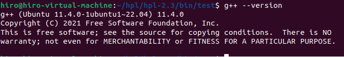

# 高性能计算实践-实验八

220110519 邢瑞龙 2023秋季

## 实验环境

1. OS：Linux Ubuntu 22.04
2. gcc: version 11.40(Ubuntu 11.40-1Ubuntu ~22.04)
3. CPU:11th Gen Intel(R) Core(TM) i7-1165G7 @2.80GHz cpu cores:2 (虚拟机)
4. 内存 3911MB

## cpu

cpu颗数:2  
核数：4核 
每核1线程 
基准频率：2.8G

## CPU的浮点数峰值性能理论值

计算公式为：

浮点数峰值性能=CPU核心数x频率x16 

4x2.8x16=179.2Gflops
## 依赖版本
**gcc**

**g++**

**openmpi**

## 参数调优及其说明
使用自动调参工具: [advancedclustering](https://www.advancedclustering.com/act_kb/tune-hpl-dat-file/) 
手调与自动调参结果对比:
 

**自调**

(详情见txt文件)

**工具**

(详情见txt文件)

* 明显自动调参下hpl测试效果更好，矩阵规模变大同时p处理器数从2变为1,测试得到Gflops为11Gflops
## 遇到的问题
* 不知道怎么运行hpl测试：依靠csdn解决
* 不知如何调参：使用调参工具