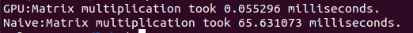
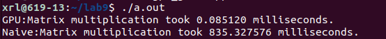
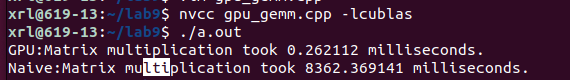
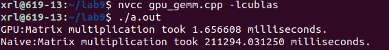

# 高性能计算实践-实验九

220110519 邢瑞龙 2023秋季

## 实验环境

1. Linux version： 5.15.0-43-generic (buildd@lcy02-amd64-076)
2. gcc： Ubuntu 11.2.0-19ubuntu1
3. CPU:1Intel(R) Xeon(R) W-2123 CPU @ 3.60GHz
4. 内存 ： 31758 MB
5. GPU：2080TI
6. cuda版本：10.1
   nvcc: NVIDIA (R) Cuda compiler driver
   Copyright (c) 2005-2019 NVIDIA Corporation
   Built on Sun_Jul_28_19:07:16_PDT_2019
   Cuda compilation tools, release 10.1, V10.1.243

## GPU上实现矩阵加速

本次实验主要利用cuda中的cublas函数库完成矩阵乘法：

代码如下

```
#include <stdio.h>
#include <stdlib.h>
#include <cuda_runtime.h>
#include <cublas_v2.h>
#include <time.h>
#include <unistd.h>
#include <sys/time.h>
int main() {
    // 设置矩阵的维度
    int m = 1024;
    int n = 1024;
    int k = 1024; 

    // 分配并初始化CPU上的输入矩阵
    float* A = (float*)malloc(m * k * sizeof(float));
    float* B = (float*)malloc(k * n * sizeof(float));
    for (int i = 0; i < m * k; i++) {
        A[i] = i;
    }
    for (int i = 0; i < k * n; i++) {
        B[i] = i;
    }

    // 在GPU上分配内存
    float* d_A;
    float* d_B;
    float* d_C;
    cudaMalloc((void**)&d_A, m * k * sizeof(float));
    cudaMalloc((void**)&d_B, k * n * sizeof(float));
    cudaMalloc((void**)&d_C, m * n * sizeof(float));

    // 将数据从主机复制到设备
    cudaMemcpy(d_A, A, m * k * sizeof(float), cudaMemcpyHostToDevice);
    cudaMemcpy(d_B, B, k * n * sizeof(float), cudaMemcpyHostToDevice);

    // 创建cuBLAS句柄
    cublasHandle_t handle;
    cublasCreate(&handle);

    // 创建CUDA事件来测量时间
    cudaEvent_t start, stop;
    cudaEventCreate(&start);
    cudaEventCreate(&stop);
    // 启动计时器
    cudaEventRecord(start, 0);
    // 执行矩阵乘法
    float alpha = 1.0;
    float beta = 0.0;
    cublasSgemm(handle, CUBLAS_OP_N, CUBLAS_OP_N, m, n, k, &alpha, d_A, m, d_B, k, &beta, d_C, m);
    // 停止计时器
    cudaEventRecord(stop, 0);
    cudaEventSynchronize(stop);
    float milliseconds = 0;
    cudaEventElapsedTime(&milliseconds, start, stop);

    // 输出运行时间
    printf("GPU:Matrix multiplication took %f milliseconds.\n", milliseconds);

    // 将结果从设备复制到主机
    float* C = (float*)malloc(m * n * sizeof(float));
    cudaMemcpy(C, d_C, m * n * sizeof(float), cudaMemcpyDeviceToHost);
    //实现朴素矩阵乘法
    cudaEvent_t start2, stop2;
    cudaEventCreate(&start2);
    cudaEventCreate(&stop2);
    cudaEventRecord(start2, 0);
    for(int i=0;i<m;i++)
    {
    	for(int j=0;j<n;j++)
    	{
    		for(int p=0;p<k;p++)
    		{
    			c[i*n+j]+=A[i*k+p]*B[p*n+j];
    		}

    	}
    }
    cudaEventRecord(stop2, 0);
    cudaEventSynchronize(stop2);
    float milliseconds2 = 0;
    cudaEventElapsedTime(&milliseconds2, start2, stop2);
    // 输出运行时间
    printf("Naive:Matrix multiplication took %f milliseconds.\n", milliseconds2);
    /* 打印结果
    for (int i = 0; i < m; i++) {
        for (int j = 0; j < n; j++) {
            printf("%f ", C[i * n + j]);
        }
        printf("\n");
    }*/

    // 释放内存和句柄
    free(A);
    free(B);
    free(C);
    cudaFree(d_A);
    cudaFree(d_B);
    cudaFree(d_C);
    cublasDestroy(handle);
    cudaEventDestroy(start);
    cudaEventDestroy(stop);
    cudaEventDestroy(start2);
    cudaEventDestroy(stop2);

    return 0;
}


```


## 不同规模下对比

256^3规模：<br>



GPU和朴素矩阵乘积相差为$10^{3}$ 数量级


512^3规模：



GPU和朴素矩阵乘积相差为$10^{4}$ 数量级


1024^3规模：



GPU下计算时间在毫秒级别，而朴素矩阵乘法在秒级别，相差$10^{3}$ 数量级


2048^3下规模：



GPU和朴素矩阵乘积相差更是达到$10^{5}$ 数量级


## 原理分析

1. GPU和CPU硬件设计不同：GPU 是为大规模的并行运算而优化而CPU 主要为串行指令而优化。GPU流处理器数量是 CPU 物理核心的上百倍
2. cublas利用gpu的大量的小处理核心进行并行运算
3. cublas同样也采取分块矩阵乘法降低时间复杂度

3. cublas利用了共享内存使得分块矩阵运算时的一个Block内的thread都能访问：数据从全局内存加载一次到共享内存，然后再反复使用

## 参考文章

([CUDA编程：矩阵乘运算从CPU到GPU - 知乎 ](https://zhuanlan.zhihu.com/p/573271688))

[搭建个人深度学习工作站（环境篇） - xyfJASON](https://xyfjason.top/blog-main/2022/12/11/搭建个人深度学习工作站（环境篇）/)

